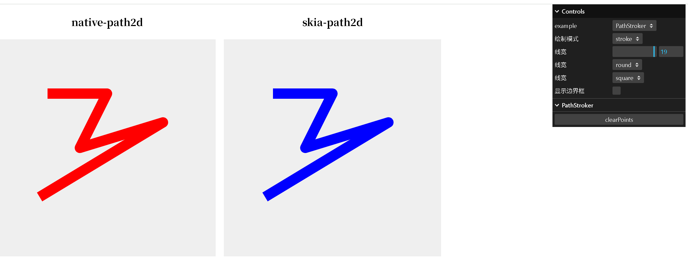
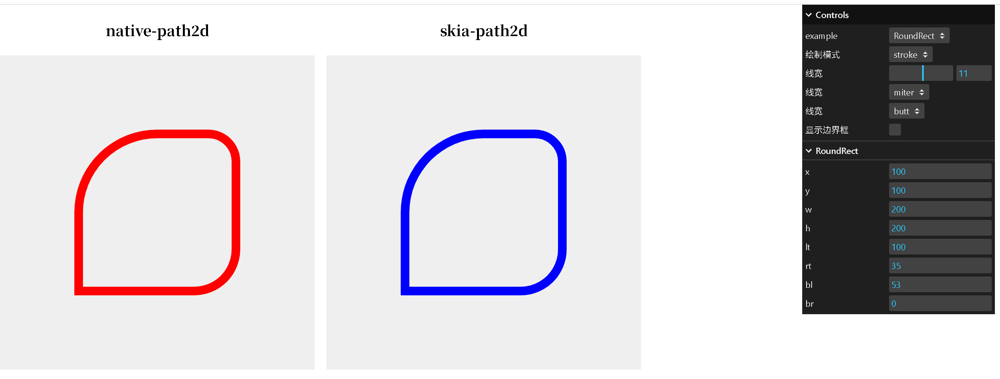
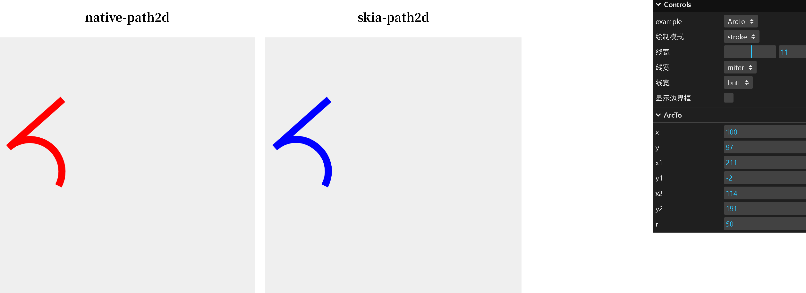

# SkiaPath2D  
Extracts core code related to Path2D, PathStore, and isPointInPath from the Skia source code and rewrites it in TypeScript.  

**PathBuilder**: The core class, ported from Skia's PathBuilder class, with some methods rewritten to remove redundant code and simplify logic.  

Additionally, a **Path2D** object is added to ensure compatibility with the browser's native Path2D API. The rendering behavior is tested to be consistent with the native Path2D, including support for parameters such as `startAngle`, `sweepAngle`, and `rotationAngle` in methods like `arcTo`, `arc`, and `ellipse`.  

**New methods added to Path2D**:  
- `ellipseArc`  
- `conicTo`  
- `contains`  

## Core Classes  
Includes `PathBuilder`, `Path2D`, `PathStroker`, and `ProxyPath2D`:  

### PathBuilder  
Path generation, with core code ported from Skia's PathBuilder class but simplified.  

### Path2D  
Internally acts as a proxy for PathBuilder but does not directly expose PathBuilder's methods. Instead, it provides a layer of encapsulation similar to the browser's native Path2D, supporting arcs, ellipses, rounded rectangles, and maintaining identical rendering effects and parameters.  

Additional methods:  
- `conicTo`, `ellipseArc`, `getBounds`, `computeTightBounds`, `contains`, `fromSvgPath`, `toSvgPath`, `toPath2D`, `toCanvas`.  
- The `contains` method is fully ported from Skia, ensuring hit testing accuracy matches the browser's behavior, even for complex shapes with `lineJoin`, `lineCap`, and curved lines (e.g., `ellipseArc`, `conicTo`).  

### PathStroker  
Generates stroke outlines from paths, with core code ported from Skia's PathStroker class.  

### ProxyPath2D  
A lightweight proxy for `Path2D` that only stores commands and coordinates without generating actual rendering paths. For example:  
- `Path2D` approximates curves through calculations, while `ProxyPath2D` directly stores commands and coordinates (e.g., `PathCommand<'E', [number, number, number, number, number, number, number, boolean]>`).  

## Bounding Box  
```typescript
path.getBounds(); // Bounding box includes curve control points  
path.computeTightBounds(); // Excludes curve control points  
```

## Hit Testing  
```typescript
// Check if a point is inside the fill area  
path.contains(x, y, "evenodd" | "nonzero");  

// Check if a point is on the path  
let newPath = stroker.stroke(path, {  
    strokeWidth: 20,  
    lineJoin: 'round', // 'miter' | 'round' | 'bevel'  
    lineCap: 'butt',  
    miterLimit: 10  
});  
newPath.contains(x, y);  
```

## Usage in Canvas  
```typescript
import { Path2D, PathStroker, PathBuilder } from 'skia-path2d';  

let canvas = document.createElement('canvas');  
let ctx = canvas.getContext('2d');  

let path2d = new Path2D();  
path2d.ellipse(100, 100, 50, 60, 0, 0, Math.PI * 2, false);  
path2d.toCanvas(ctx);  
```

## Usage in SVG  
```typescript
let svgCmd = 'M100 100A50 60 0 1 1 100 100 Z';  
let path = new Path2D(svgCmd);  
path.arc(100, 100, 100, 0, Math.PI * 2, false);  
// Or:  
path.ellipseArc(100, 100, 50, 60, 0, 0, Math.PI * 2, false);  
let svgCmd = path.toSvgPath(); // Returns SVG path string  

// In SVG:  
<path d={`${svgCmd}`} />  
```

## Usage in WebGL  
```typescript
import { tesselate } from 'tess2';  

let path = new Path2D();  
path.arc(100, 100, 100, 0, Math.PI * 2, false);  

let stroker = new PathStroker();  
let path_builder = path.getPath();  
let newPathBuild = stroker.stroke(path_builder, {  
    strokeWidth: 20,  
    lineJoin: 'round', // 'miter' | 'round' | 'bevel'  
    lineCap: 'butt',  
    miterLimit: 10  
});  

// WebGL rendering  
let gl = canvas.getContext('webgl');  
const res = tesselate({  
    windingRule: 1,  
    contours: newPathBuild.toPolygons(),  
    vertexSize: 2,  
})!;  

// Process triangles  
let vertices = [];  
for (let i = 0; i < res.elements.length; i += 3) {  
    let a = res.elements[i], b = res.elements[i + 1], c = res.elements[i + 2];  
    vertices.push(  
        res.vertices[a * 2], res.vertices[a * 2 + 1],  
        res.vertices[b * 2], res.vertices[b * 2 + 1],  
        res.vertices[c * 2], res.vertices[c * 2 + 1]  
    );  
}  

let vertexBuffer = gl.createBuffer();  
gl.bindBuffer(gl.ARRAY_BUFFER, vertexBuffer);  
gl.bufferData(gl.ARRAY_BUFFER, new Float32Array(vertices), gl.STATIC_DRAW);  
gl.enableVertexAttribArray(0);  
gl.vertexAttribPointer(0, 2, gl.FLOAT, false, 0, 0);  
gl.drawArrays(gl.TRIANGLES, 0, vertices.length / 2);  
gl.disableVertexAttribArray(0);  
```

## PathStore效果
通过PathStroker 生成的描边轮廓与原生几乎一致

## RoundRect

## ArcTo

